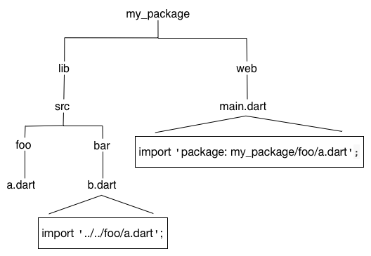

库包的代码位于 lib 目录中， 在其他包中可以访问这里面的代码。
在 lib 目录下可以创建任意的目录结构。
通常情况下都把实现代码放到 lib/src 目录中。
位于 lib/src 下面的代码被认为是私有的；
其他包不应该直接导入 src/... 里面的代码。
要分享 lib/src 下的 API，你可以在 lib 目录下 创建一个文件，
在这个文件中导入 lib/src 中的代码。

最简单的库包的 目录结构

shelf 库的目录结构

在 lib 和 web 库中如何导入 lib/src/foo/a.dart

